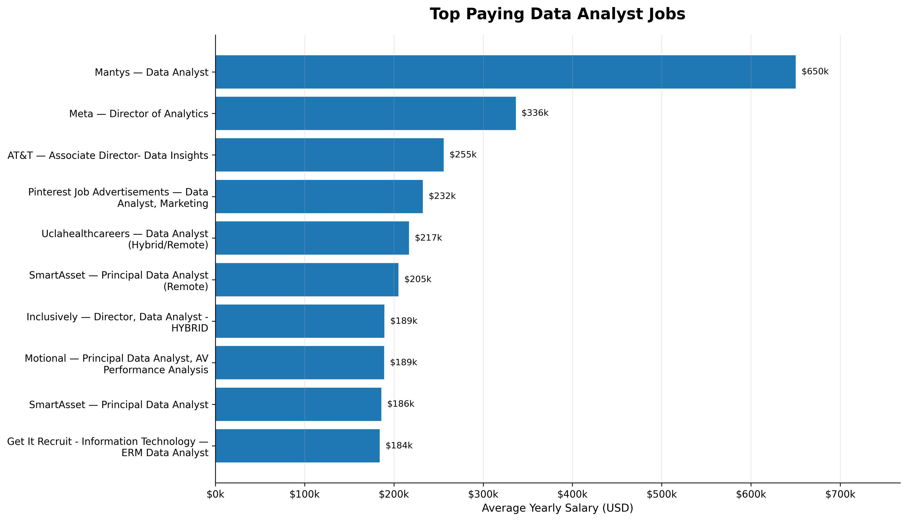
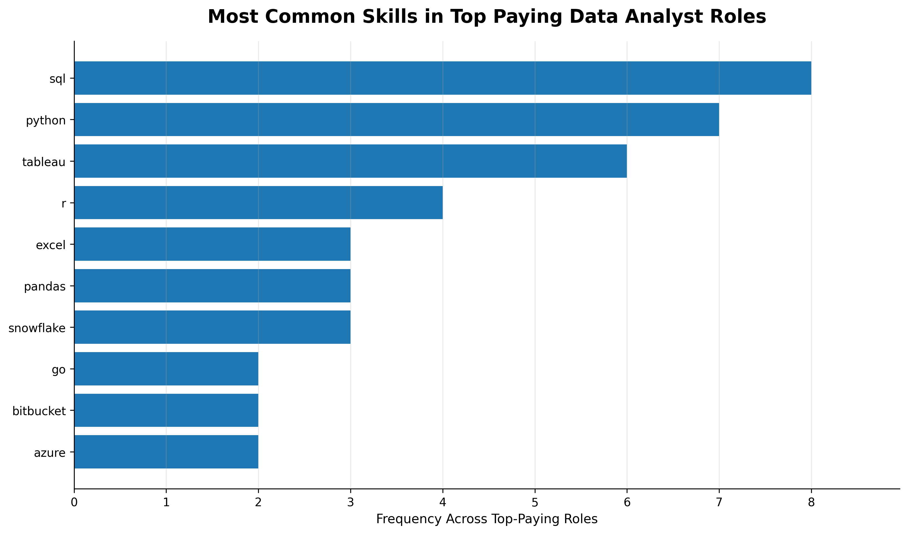
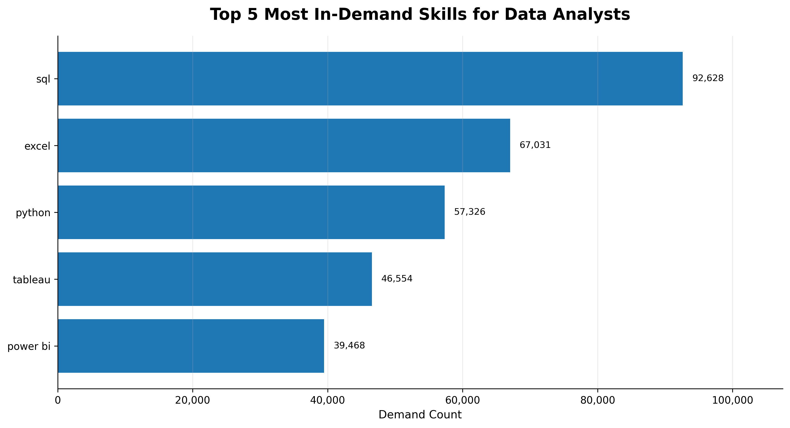
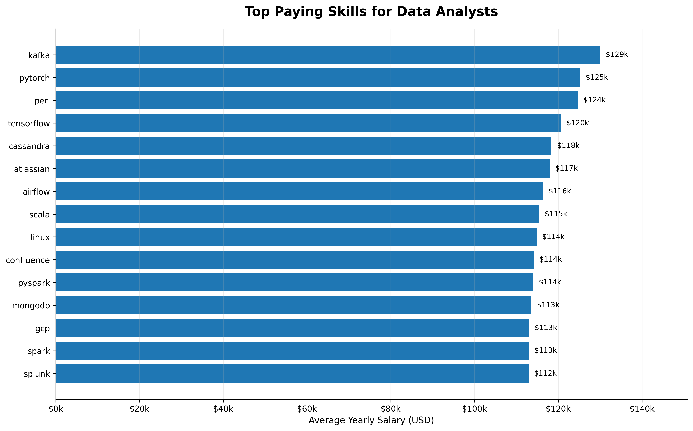
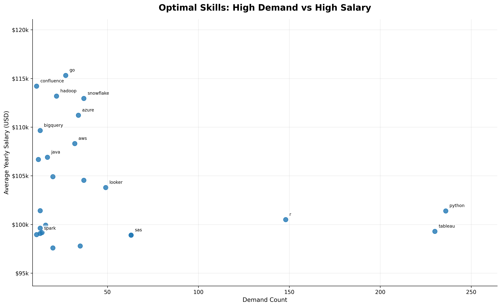

# Introduction 
📊 Dive into the data job market! Focusing on data analyst roles, this project explores top-paying jobs, in-demand skills, and where high demand meets high salary in data analytics.

SQL queries? Check them out here: [analysis_queries folder](/analysis_queries/)

# Background 
Driven by a quest to navigate the data analyst job market more effectively, this project was born from a desire to pinpoint top-paid and in-demand skills, streamlining others work to find optimal jobs.

Data hails from my [SQL Course](https://lukebarousse.com/sql). It's packed with insights on job titles, salaries, locations, and essential skills.

### The questions I wanted to answer through my SQL queries were:

1. What are the top-paying data analyst jobs?
2. What skills are required for these top-paying jobs?
3. What skills are most in demand for data analysts?
4. Which skills are associated with higher salaries?
5. What are the most optimal skills to learn?

# Tools I Used
For my deep dive into the data analyst job market, I harnessed the power of several key tools:

- **SQL:** The backbone of my analysis, allowing me to query the database and unearth critical insights.
- **PostgreSQL:** The chosen database management system, ideal for handling the job posting data.
- **Visual Studio Code:** My go-to for database management and executing SQL queries.
- **Git & GitHub:** Essential for version control and sharing my SQL scripts and analysis, ensuring collaboration and project tracking.

# Database Structure
The project uses a star-schema style relational structure:

- `job_postings_fact` → main fact table containing job posting information
- `company_dim` → company metadata
- `skills_dim` → skill definitions and categories
- `skills_job_dim` → bridge table connecting jobs and skills

This structure enabled efficient joins and scalable analytical querying across salary, location, and skill dimensions.

# Data Exploration & Cleaning

Before conducting the main analysis, exploratory SQL queries were used to better understand the structure, quality, and limitations of the dataset.

Initial exploration revealed several real-world data quality issues and analytical considerations:

- Job locations appeared in inconsistent formats
  - e.g. `London, UK`, `Greater London, UK`, `London, United Kingdom`
- Remote roles were represented using the label `Anywhere`
- Only approximately **2.8%** of postings contained non-null salary information
- Salary analysis therefore relied on a smaller subset of disclosed postings
- Certain salary outliers required additional filtering considerations
- Skills associated with very low posting counts could distort average salary calculations

To improve analytical relevance and statistical reliability, the project focused primarily on:
- UK-based London roles
- Remote positions
- postings with disclosed salaries
- skills appearing in a meaningful number of postings
- filtering techniques to reduce low-frequency salary outliers

The exploratory phase also included:
- country and location-level job distribution analysis
- remote vs non-remote job counts
- salary distribution inspection
- common job title analysis
- date-range validation of postings

These exploratory steps helped ensure the later analysis was both analytically relevant and methodologically defensible.

# The Analysis
Each query for this project aimed at investigating specific aspects of the data analyst job market. Here’s how I approached each question:

## 1. Top Paying Data Analyst Jobs
The analysis identified the highest-paying Data Analyst opportunities across London-based UK roles and remote positions. 
Results showed that remote roles dominated the upper salary range, with compensation levels significantly increasing for senior and strategic analytics positions.

### Key Insights
- Remote roles accounted for the majority of the highest-paying opportunities.
- Senior analytics and leadership roles commanded significantly higher salaries.
- Large technology-driven firms appeared frequently among the top-paying employers.
- Salary outliers highlighted the importance of exploratory analysis and validation.

---

---

## 2. Skills Required for Top Paying Jobs
This analysis explored the skills associated with the highest-paying Data Analyst roles.

### Key Insights
- SQL appeared most frequently, reinforcing its importance as a core analytics skill.
- Python strongly correlated with higher-paying analytical positions.
- Tableau and cloud-related technologies appeared frequently in premium-paying roles.
- High-paying analyst positions increasingly overlap with engineering and infrastructure responsibilities.

 ---

---

## 3. Most In-Demand Skills

This query identified the skills most frequently requested across Data Analyst job postings.

### Key Insights
- SQL was both the most demanded and one of the most valuable skills.
- Excel remained highly demanded despite the growth of modern analytics tools.
- Python, Tableau, and Power BI demonstrated the increasing importance of technical and visual analytics capabilities.

---

---

## 4. Top Paying Skills

This analysis focused on the average salary associated with specific skills while filtering low-frequency outliers.

### Key Insights
- Big data and cloud technologies such as Spark, Snowflake, and Databricks were associated with premium salaries.
- Programming-oriented analytical skills generally commanded higher compensation.
- Applying a minimum posting threshold improved the statistical reliability of salary averages.

---

---

## 5. Optimal Skills to Learn

This analysis combined both demand and salary metrics to identify the most strategically valuable skills.

### Key Insights
- SQL and Python occupied strong positions across both demand and salary dimensions.
- Cloud and distributed data technologies showed strong salary performance despite lower demand.
- The market increasingly rewards hybrid analytical and engineering skillsets.

---

---

# What I Learned

Through this project, I strengthened my ability to:

- Perform exploratory data analysis on large relational datasets
- Work with many-to-many relationships using bridge tables
- Apply aggregation and filtering techniques to derive business insights
- Handle real-world data quality issues such as inconsistent location formatting and sparse salary disclosure
- Design analytical queries balancing both statistical reliability and business relevance

# Conclusion
This analysis revealed that the modern data analyst market increasingly rewards hybrid technical skillsets combining:

- SQL
- Python
- cloud/data infrastructure tools
- business intelligence platforms

While traditional BI skills remain highly demanded, higher-paying opportunities increasingly overlap with data engineering and scalable analytics capabilities.

The project also highlighted the importance of exploratory data analysis and statistical filtering when working with real-world labour market datasets.

